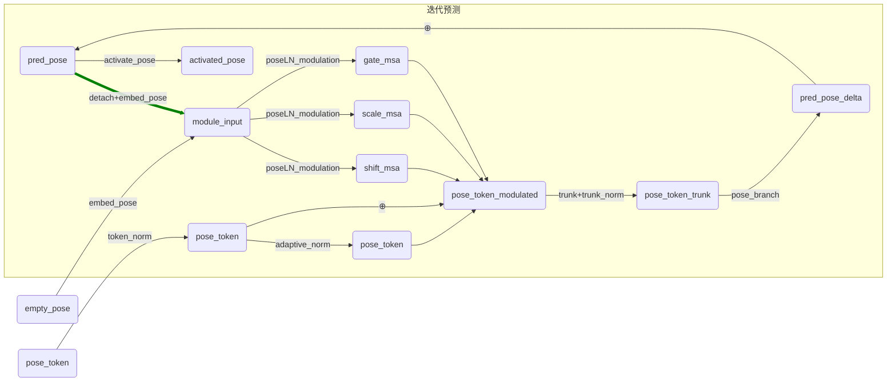
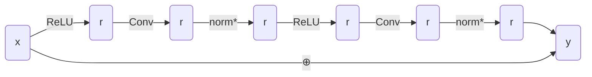
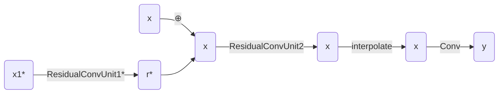

<h1>VGGT 网络结构——heads</h1>

## [HeadAct](./head_act.py)
+ `activate_pose()`：对预测的相机姿态参数进行激活处理，分三个部分 $\mathbf{g}=[\mathbf{q},\mathbf{t},\mathbf{f}]\in\mathbb{R}^9$
    - $\mathbf{t}\in\mathbb{R}^3$：平移向量 $\xrightarrow{\text{激活函数}_1}$ $\mathbf{t}'\in\mathbb{R}^3$
    - $\mathbf{q}\in\mathbb{R}^4$：旋转四元数 $\xrightarrow{\text{激活函数}_2}$ $\mathbf{q}'\in\mathbb{R}^4$
    - $\mathbf{f}\in\mathbb{R}^2$：焦距 $\xrightarrow{\text{激活函数}_3}$ $\mathbf{f}'\in\mathbb{R}^2$
    - 输出 $\mathbf{g}'=[\mathbf{q}',\mathbf{t}',\mathbf{f}']\in\mathbb{R}^9$
+ `activate_head()`：处理 3D 点云预测网络的输出，得到预测结果和置信度
    - 输入：网络输出张量 `output`：${B\times C\times H\times W}\to B\times H\times W\times C$
    - `xyz`：$B\times H\times W\times (C-1)\xrightarrow{\text{激活函数}_1}$ `points`
    - `confidence`：$B\times H\times W\times 1\xrightarrow{\text{激活函数}_2}$ `confidence`
    - 输出：预测结果 `points` $\in\mathbb{R}^{B\times H\times W\times (C-1)}$，置信度 `confidence` $\in\mathbb{R}^{B\times H\times W\times 1}$

## [CameraHead](./camera_head.py)
+ 迭代预测相机姿态参数，得到相机姿态 $\mathbf{g}=[\mathbf{q},\mathbf{t},\mathbf{f}]\in\mathbb{R}^9$
+ 下面所有的 norm 均使用 Layer Normalization
+ `pose_token`：预测得到的相机姿态的 token 表示，维度为 $d$
  - `pose_tokens`：$\mathbb{R}^{B\times S\times d}$ $\xrightarrow{\text{token_norm()}}$ `pose_tokens`
+ `embed_pose()`：将相机姿态参数编码为 token，本质为 $\xrightarrow{线性层(9\to d)}$
  - `pred_pose`：$\mathbb{R}^9$ $\xrightarrow{\text{embed_pose()}}$ `module_input`：$\mathbb{R}^d$
+ `poseLN_modulation()`：对 token 进行调制，本质为 $\xrightarrow{\text{SiLU}激活函数}\xrightarrow{线性层(d\to 3d)}$
+ `adaptive_norm()`：自适应层归一化，即只根据输入进行归一化，没有可学习的缩放和偏移参数
  - `module_input`：$\mathbb{R}^d\xrightarrow{\text{poseLN_modulation()}}$ $\mathbb{R}^{3d}\xrightarrow{分块}$ `gate_msa, scale_msa, shift_msa`：$\mathbb{R}^d$
  - `pose_token_modulated`：$\mathbb{R}^d=$ `gate_msa * (self.adaptive_norm(pose_token) * (1 + scale_msa) + shift_msa) + pose_token`
+ `trunk()`：残差注意力模块，本质为 `trunk_depth` 个 `Block` 模块拼接而成
+ `pose_branch()`：将 token 表示解码为相机姿态，本质为 $\xrightarrow{\text{MLP}(d\to 9)}$
  - `pose_token_modulated`：$\mathbb{R}^d\xrightarrow{\text{trunk()}}$ $\xrightarrow{\text{trunk_norm()}}$ $\xrightarrow{\text{pose_branch()}}$ `pred_pose_delta`：$\mathbb{R}^9$
  - `pred_pose`：$\mathbb{R}^9=$ `pred_pose_delta + pred_pose`，初始为 `None` 故直接赋值为 `pred_pose_delta`
+ `activated_pose`：对预测的相机姿态参数进行激活处理
  - `pred_pose`：$\mathbb{R}^9\xrightarrow{\text{activate_pose()}}$ `activated_pose`：$\mathbb{R}^9$
  - 将每一轮预测的 `activated_pose` 添加到 `pred_pose_list` 中，最后返回 `pred_pose_list`

## [DPTHead](./dpt_head.py)
+ 对深度图 $D$、点云图 $P$、跟踪特征 $T$ 和置信度 $c$ 进行预测
+ 根据 `frames_chunk_size` 决定是否分块处理，将 `frames` 送入 `_froward_frame()` 函数
+ `_forward_frame()`：

⭐以下是两个组件模块的实现：
### (1). ResidualConvUnit
+ `ResidualConvUnit()`：残差卷积单元
+ 输入输出维度为 `features`$=d$，网络结构如下：

### (2). FeatureFusionBlock
+ `FeatureFusionBlock()`：特征融合模块，若 `has_residual` 为 `True`，则将 `x` 与 `x1` 两个特征进行特征融合
+ 输入维度为 `features`$=d_1$，输出维度为 `out_features`$=d_2$，网络结构如下：

⭐辅助函数的功能：
### (1). `apply_pos_embed()`
+ `create_uv_grid()`：生成网格坐标 $(u,v)$，将其归一化到 $[-1,1]$ 范围内
+ `position_grid_to_embed()`：将 2D 坐标网格转换为高维的正弦余弦位置嵌入向量
  - `make_sincos_pos_embed()`：

