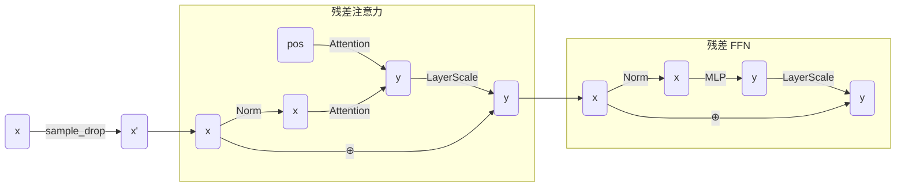
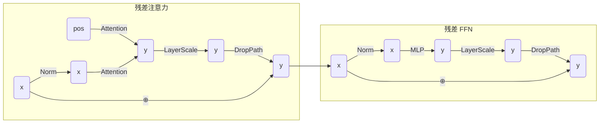
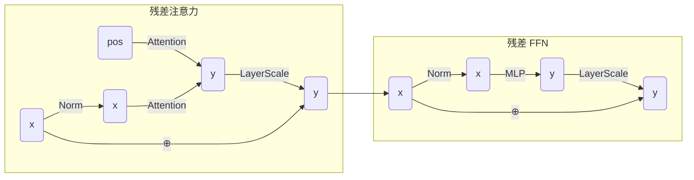

<h1>VGGT 网络结构</h1>

## [Attention](./attention.py)
### 1. Attention
+ `x`：$B\times N\times C\xrightarrow{\text{线性层}(C\to3C)}B\times N\times 3C\to B\times N\times 3\times n\times d\to 3\times B\times n\times N\times d$
    - `n`：`head` 的数量
    - `d`：`head` 的维度
    - $C=n\times d$
+ `q, k, v`：$B\times n\times N\times d$
+ `q` $\to$ `q_norm(q)`，`k` $\to$ `k_norm(k)`
+ $^*$**旋转位置编码**：`q` $\to$ `rope(q, pos)`，`k` $\to$ `rope(k, pos)`
    > 通过旋转矩阵将位置信息编码到注意力机制的查询和键中
+ `x` $\to\ \begin{align}\text{softmax}\left(\frac{QK^T}{\sqrt{d}}\right)V\end{align}$
+ `x`：$B\times n\times N\times d\to B\times N\times n\times d\to B\times N\times C$
+ **输出投影**和 **Dropout** **正则化**：`x` $\to$ `proj_drop(proj(x))`
### 2. MemEffAttention
+ 将`Attention` 的 `q, k, v` 分块计算，减少显存占用
    - `summarize_qkv_chunk()`：每个分块的 `q, k, v` 注意力计算
    - `memory_efficient_attention()`：整体计算框架，将 `q, k, v` 分块计算后再拼接

## [MLP](./mlp.py)
+ `x`：$B\times N\times C_i\xrightarrow{\text{线性层}(C_i\to C_h)} B\times N\times C_h$
    - `C_i`：输入通道数
    - `C_h`：隐藏层通道数，默认值为 `C_i`
    - `C_o`：输出通道数，默认值为 `C_i`
+ `x` $\to$ `nn.GELU(x)`
+ `x` $\to$ `drop(x)`
+ `x`：$B\times N\times C_h\xrightarrow{\text{线性层}(C_h\to C_o)} B\times N\times C_o$
+ `x` $\to$ `drop(x)`

## [PatchEmbed](./patch_embed.py)
+ 将 2D 图像划分为块 `patch`，并展平为 1D 向量
+ `x`：$B\times C\times H\times W$ $\xrightarrow{\text{卷积层}(C\to d)}$ $B\times d\times h\times w\to B\times d\times hw\to B\times hw\times d$
    - `d`：`patch` 的维度
    - `h, w`：`patch` 的数量大小
    - `patch_size`：`patch` 的大小
    - 卷积层：`nn.Conv2d(C, d, kernel_size=patch_size, stride=patch_size)`
+ `x` $\to$ `norm(x)`

## [DropPath](./drop_path.py)
+ 在一个 batch 中，随机地"丢弃"或"跳过"某些样本
+ 若 `drop_prob=0` 或 `training=False`，则 `x` 不变
+ `shape`：$B\times 1\times 1\cdots\times 1$
  - 与 `x` 的形状总维度数相同
+ `random`：对于 batch 中的每个样本，使用伯努利分布生成一个随机数 0/1，表示是否丢弃
+ `random` $\to$ `random / keep_prob`
  - 为了保证期望相同
+ `x` $\to$ `x * random`

## [LayerScale](./layer_scale.py)
+ 层缩放用于自适应地调整残差分支的权重 $\mathbf{\gamma}$，权重在训练过程中学习
+ `x`：`x * gamma`

## [Block](./block.py)
### 1. Block
+ 在 Train 过程，若 `self.sample_drop_ratio` $> 0.1$，则：

+ 在 Train 过程，若 $0<$ `self.sample_drop_ratio` $\leq 0.1$，则：

+ 在 Test 过程，或 `self.sample_drop_ratio` $= 0$，则：

### 2. NestedTensorBlock

