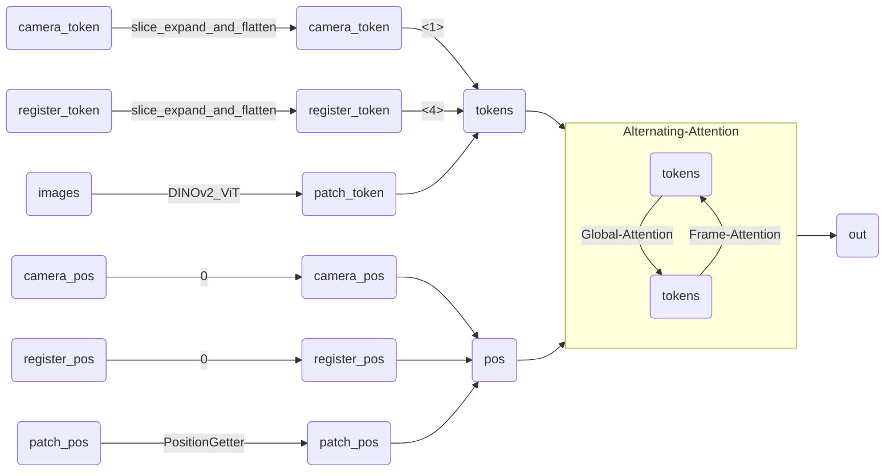
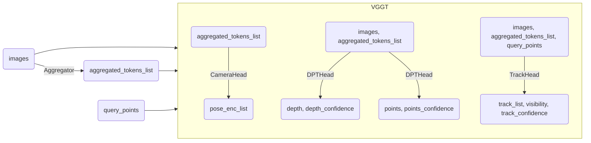

<h1>VGGT 网络结构——models</h1>

## [Aggregator](./aggregator.py)
+ VGGT 的核心模块，负责将图像和相机参数编码为 token，并使用交替注意力机制进行特征提取。
+ `silice_expand_and_flatten()`：将输入的 `camera_token`：$1\times 2\times 1\times C$ 和 `register_token`：$1\times 2\times 4\times C$ 扩展到维度 $B\times S\times 1/4 \times C$。
    - 第一帧 $S=1$ 用 $[:, 0, :, :]$ 扩展，其他 $S-1$ 帧用 $[:, 1, :, :]$ 扩展，以区分第一帧（作为基准坐标系）。

## [VGGT](./vggt.py)
+ VGGT 的主体模块，输入图像和待追踪点，输出相机参数、重建结果和追踪结果
